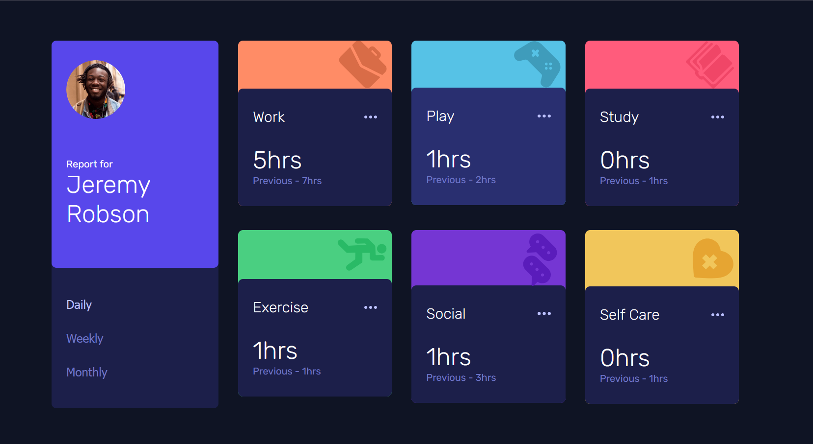

# Frontend Mentor - Time tracking dashboard solution

This is my solution to the [Time tracking dashboard challenge on Frontend Mentor](https://www.frontendmentor.io/challenges/time-tracking-dashboard-UIQ7167Jw). Frontend Mentor challenges help you improve your coding skills by building realistic projects.

### Screenshot

### Links

- Solution URL: [Add solution URL here](https://github.com/okayishmael/time-tracking-dashboard)
- Live Site URL: [Add live site URL here](https://okayishmael.github.io/time-tracking-dashboard/)

## My process

First time fetching from json file.

### Built with

Full Responsibility

- Semantic HTML5 markup
- CSS custom properties
- Flexbox
- CSS Grid
- Mobile-first workflow
- Googel Fonts

Teamed Up

- JavaScript

## Author

- Website - [Ishmael on Github](https://github.com/okayishmael)
- Frontend Mentor - [@okayishmael](https://www.frontendmentor.io/profile/okayishmael)
- Linkedin - [Ishmael Sunday on Linkedin](https://www.linkedin.com/in/ishmael-sunday)
